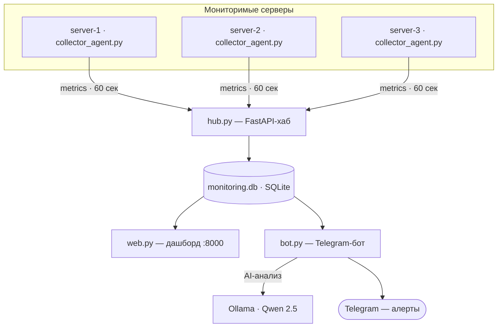
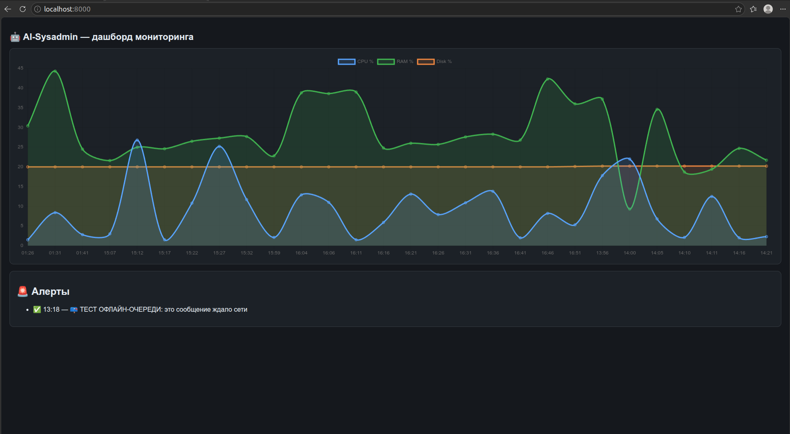
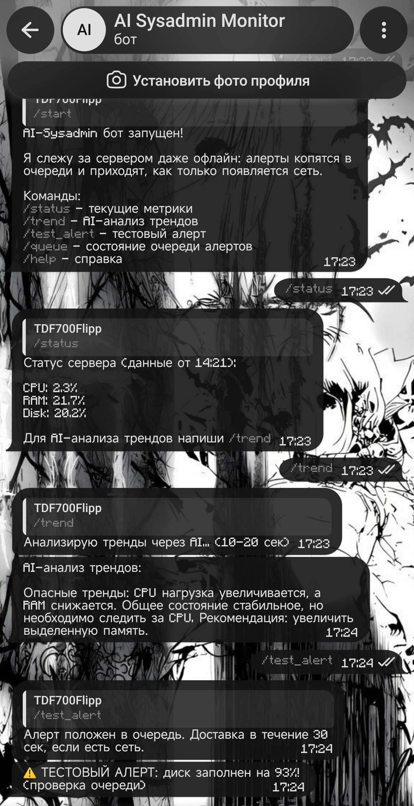
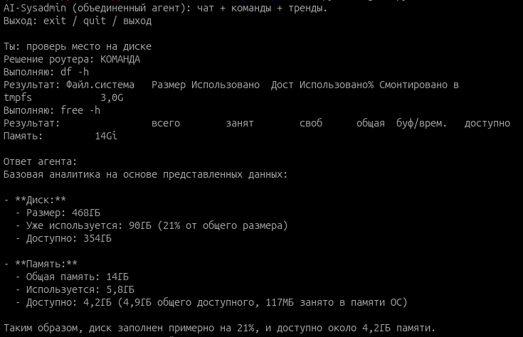
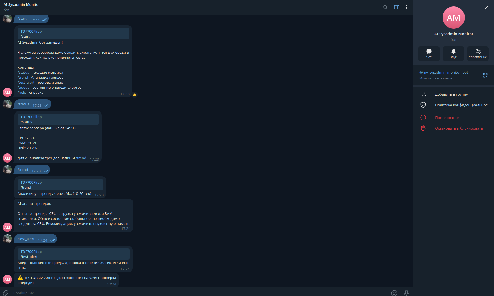

🤖 AI-Sysadmin — локальный ИИ-агент для мониторинга Linux-сервера
> Автономная система мониторинга **и полного управления** с локальной LLM: собирает метрики с нескольких серверов, анализирует тренды и логи, присылает алерты в Telegram и даёт 30+ команд администрирования — **без облака, без API-ключей, без отправки данных наружу**.


---

## 🎯 О проекте

**AI-Sysadmin** — это «Zabbix с мозгами и руками». Система сама следит за здоровьем Linux-серверов, находит тренды с помощью локальной нейросети, предупреждает о проблемах **до того**, как они станут аварией, — и позволяет **полностью администрировать ОС через Telegram**.

- 🔒 **100% приватно** — модель Qwen 2.5 работает локально через Ollama
- 🖥 **Мульти-серверно** — hub-архитектура: агенты на серверах шлют метрики на центральный хаб
- 🛡 **Отказоустойчиво** — офлайн-очередь алертов (store-and-forward): уведомления не теряются без сети
- 🧠 **Умно** — ИИ объясняет тренды, анализирует логи и даёт рекомендации, а не просто показывает цифры
- 🎛 **Управляемо** — 30+ команд: терминал, пользователи, cron, firewall, Docker, бэкапы, Wi-Fi

---

## 🏗 Архитектура



# ⚙️ Возможности

| Компонент | Что умеет |
|---|---|
| 📥 collector_agent.py | Агенты на серверах: сбор CPU / RAM / Disk / Network каждые 60 сек → отправка на хаб |
| 🌐 hub.py | FastAPI-хаб: приём метрик от всех агентов, хранение в SQLite |
| 📊 web.py | Веб-дашборд: графики Chart.js, история метрик, выбор сервера, автообновление |
| 🤖 bot.py | Telegram-бот: 30+ команд, авто-алерты, офлайн-очередь, AI-анализ |
| 🧠 log_analyzer.py | AI-анализ системных логов на аномалии |
|  full_control.py | Полное управление Linux: терминал, пользователи, cron, firewall, Docker, бэкапы |
| 🚨 Алертинг | Disk > 85%, RAM > 90%, CPU > 95%, «молчание» агента > 15 мин |
| 📬 Офлайн-очередь | Алерты копятся в SQLite и доставляются при появлении сети |
| 🐳 Docker | 6 контейнеров: hub, 3 агента, web, bot |
| 🔄 systemd | Автозапуск при старте ОС и автоперезапуск при падении |

---

{screenshots}

---

## 📱 Команды Telegram-бота (30+)

### 📊 Мониторинг и AI
| Команда | Описание |
|---|---|
| `/status` | Текущие метрики всех серверов |
| `/trend` | AI-анализ трендов метрик за последние часы |
| `/logs` | AI-анализ системных логов на аномалии |
| `/queue` | Состояние офлайн-очереди алертов |
| `/test_alert` | Проверка системы алертов |

### 🎛 Управление системой
| Команда | Описание |
|---|---|
| `/services` | Управление systemd-сервисами (start/stop/restart) |
| `/processes` | Топ процессов, kill по PID |
| `/packages` | Установка/удаление пакетов |
| `/network` | Сетевая информация: интерфейсы, порты, соединения |
| `/wifi` | Анализ Wi-Fi: сигнал, частота, топ-10 доступных сетей |
| `/disks` | Диски и разделы (lsblk) |

### 🖥 Терминал и файлы
| Команда | Описание |
|---|---|
| `/cmd <команда>` | Выполнить команду (whitelist безопасности) |
| `/dir <путь>` | Содержимое директории |
| `/read <путь>` | Прочитать файл |

### 👥 Пользователи и безопасность
| Команда | Описание |
|---|---|
| `/users` | Список пользователей системы |
| `/create_user <имя> [пароль] [sudo]` | Создать пользователя |
| `/firewall` | Статус UFW / iptables |
| `/add_firewall_rule <правило>` | Добавить правило firewall |

### ⏰ Автоматизация, обновления, Docker
| Команда | Описание |
|---|---|
| `/cron` / `/add_cron` | Просмотр и добавление cron-задач |
| `/updates` / `/install_updates` | Проверка и установка обновлений |
| `/docker` / `/docker_action` | Контейнеры: список, start/stop/restart/rm |
| `/backup <путь>` | Создать tar.gz резервную копию |

> ⚠️ **Безопасность:** все команды `/cmd` проходят через whitelist. Опасные операции (`rm -rf`, `shutdown`, `mkfs`...) блокируются или помечаются предупреждением.

---

## 🌐 Веб-дашборд

Открой **http://localhost:8000**:
- Графики метрик в реальном времени (Chart.js)
- История изменений CPU / RAM / Disk
- Переключение между серверами
- Автообновление каждые 30 сек

---

## 🤖 Локальный AI

Система использует **Ollama + Qwen 2.5** для:
- Анализа трендов метрик и предсказания проблем
- Анализа системных логов на аномалии
- Рекомендаций по оптимизации

Данные **не покидают твой сервер** — модель работает локально.

---

## 🚀 Быстрый старт

### 1. Установи Ollama и модель
```bash
curl -fsSL https://ollama.com/install.sh | sh
ollama pull qwen2.5:3b
## 📸 Скриншоты

| Веб-дашборд (графики метрик) | Telegram-бот (AI-анализ) |
|:---:|:---:|
|  |  |

| AI-агент в терминале | Telegram-бот на ПК |
|:---:|:---:|
|  |  |


## 🛠 Полное управление Linux

Система предоставляет **25+ команд** для полноценного администрирования сервера прямо из Telegram:

| Категория | Команды |
|---|---|
| **Терминал** | `/cmd <команда>` (с whitelist безопасных команд) |
| **Пользователи** | `/users`, `/create_user` |
| **Cron** | `/cron`, `/add_cron` |
| **Firewall** | `/firewall`, `/add_firewall_rule` |
| **Обновления** | `/updates`, `/install_updates` |
| **Docker** | `/docker`, `/docker_action` |
| **Диски и Бэкапы** | `/disks`, `/backup <путь>` |

> ⚠️ **Безопасность:** Все команды проходят через строгий whitelist. Опасные команды (например, `rm -rf`) блокируются или требуют особого подтверждения.

---


## 🛠 Полное управление Linux (30+ команд)

### 📊 Мониторинг
- `/status` — статус всех серверов
- `/trend` — AI-анализ трендов метрик
- `/logs` — AI-анализ системных логов
- `/queue` — очередь алертов (store-and-forward)

### 🔧 Управление системой
- `/services` — управление systemd-сервисами
- `/processes` — управление процессами
- `/packages` — управление пакетами
- `/network` — сетевая информация
- `/wifi` — анализ Wi-Fi (сигнал, частота, топ-10 сетей)
- `/disks` — информация о дисках

### 🖥 Терминал и файлы
- `/cmd <команда>` — выполнение команд (с whitelist безопасности)
- `/dir <путь>` — содержимое директории
- `/read <путь>` — прочитать файл

### 👥 Пользователи и безопасность
- `/users` — список пользователей
- `/create_user <имя> [пароль] [sudo]` — создать пользователя
- `/firewall` — статус UFW firewall
- `/add_firewall_rule <правило>` — добавить правило firewall

### ⏰ Автоматизация и обновления
- `/cron` — cron-задачи
- `/add_cron <расписание и команда>` — добавить cron-задачу
- `/updates` — проверка доступных обновлений
- `/install_updates` — установить обновления

### 🐳 Docker и бэкапы
- `/docker` — список контейнеров
- `/docker_action <id> <действие>` — управление контейнером
- `/backup <путь>` — создать резервную копию

---

## 🌐 Веб-дашборд

Открой http://localhost:8000 для доступа к:
- Графикам метрик в реальном времени
- Истории изменений
- Управлению серверами
- Красивому UI на FastAPI + Chart.js

---

## 🤖 Локальный AI

Система использует **Ollama с моделью Qwen 2.5** для:
- Анализа трендов метрик (предсказание проблем)
- Анализа системных логов (поиск аномалий)
- Локальной работы (без отправки данных в облако)


## 🚀 Быстрый старт

### 1. Установи Ollama и модель

```bash
curl -fsSL https://ollama.com/install.sh | sh
ollama pull qwen2.5:3b
```

### 2. Установи зависимости

```bash
python3 -m venv venv
source venv/bin/activate
pip install -r requirements.txt
```

### 3. Создай конфиг с секретами

```bash
# config.py (добавлен в .gitignore, в git не попадает)
BOT_TOKEN = "токен_от_BotFather"
ADMIN_ID = 123456789
```

### 4. Запусти компоненты

```bash
python hub.py              # хаб приёма метрик
python collector_agent.py  # агент на сервере (укажи HUB_URL)
python web.py              # веб-дашборд :8000
python bot.py              # telegram-бот
```

### 5. Production-режим: systemd-сервисы

```bash
sudo systemctl enable --now collector.service
sudo systemctl enable --now bot.service
```

---


# 📁 Структура проекта

| 🧠 Ядро системы | 🎛 Управление Linux |
|---|---|
| `collector_agent.py` — агент: сбор метрик → хаб | `full_control.py` — полное управление (whitelist) |
| `hub.py` — FastAPI-хаб: приём метрик от агентов | `control_handlers.py` — обработчики команд и кнопок |
| `collector.py` — локальный сборщик → SQLite | `manager.py` — сервисы / процессы / пакеты |
| `monitoring.db` — база метрик и очереди алертов | `log_analyzer.py` — AI-анализ системных логов |

| 🌐 Интерфейсы | 🐳 Деплой |
|---|---|
| `bot.py` — Telegram-бот: алерты + 30+ команд | `Dockerfile` — образ для Docker |
| `web.py` — веб-дашборд (FastAPI + Chart.js) | `docker-compose.yml` — hub + агенты + web + bot |
| `agent.py` — терминальный ИИ-агент | systemd-юниты — автозапуск сервисов |
| `analyzer.py` — standalone AI-анализ трендов | `config.py` — секреты (НЕ в git) |

#💡 Пример работы

**Терминальный агент:**

```text
Ты: проверь место на диске
Решение роутера: КОМАНДА
Выполняю: df -h
Ответ агента: Диск занят на 20% (88.7/467.3 GB), запас большой.

Ты: как менялась нагрузка за последнее время?
Решение роутера: ТРЕНД
Ответ агента: CPU стабилен (1-3%), RAM плавно растёт с 27% до 30% —
утечек не наблюдается. Сервер здоров, действий не требуется.
```

**Telegram-бот:**

```text
/status  →  CPU: 11.7% | RAM: 27.7% | Disk: 20.0%
/trend   →  AI-анализ трендов за последние часы
⚠️ алерт  →  ДИСК заполнен на 93%! (пришёл сам, без запроса)
```

---

## 🔒 Приватность и безопасность
Модель работает локально (Ollama) — данные не покидают сервер
Секреты хранятся в config.py вне git (.gitignore)
Команды /cmd ограничены whitelist; опасные операции блокируются
Офлайн-очередь гарантирует доставку алертов при нестабильном канале
Sudo-доступ бота ограничен списком команд в /etc/sudoers.d/ (NOPASSWD)


---

## 🗺 Roadmap

✅ Docker-упаковка (hub + агенты + web + bot одной командой)
✅ Веб-дашборд с графиками (FastAPI + Chart.js)
✅ Анализ логов на аномалии
✅ Мульти-серверный мониторинг (hub-архитектура)
✅ Полное управление Linux (30+ команд, Wi-Fi анализ)

---

## 👤 Автор

flippant · пет-проект для портфолио: от идеи «ИИ-админ для малого бизнеса» до отказоустойчивой системы мониторинга и управления с локальным ИИ.
